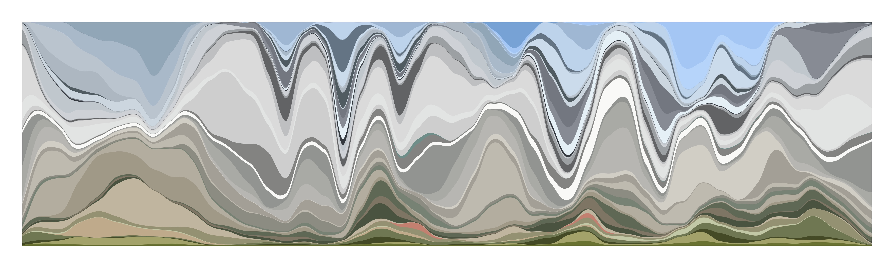

<!-- README.md is generated from README.Rmd. Please edit that file -->

```{r, include = FALSE}
knitr::opts_chunk$set(
  collapse = TRUE,
  comment = "#>",
  fig.path = "man/figures/README-",
  out.width = "100%"
)
```
# routes

<!-- badges: start -->
<!-- badges: end -->



This repo is the home of an R package that helps me create [routes](routes.cwick.co.nz).  It is provided with minimal documentation and no guarantees.

## Installation

You can install the development version from [GitHub](https://github.com/) with:

``` r
# install.packages("remotes")
remotes::install_github("cwickham/routes")
```
## Google API

routes assumes you have a Google API key stored in the environment variable `GOOGLE_API_KEY`.  Get an [API key from google](https://developers.google.com/maps/documentation/streetview/get-api-key), then run:
```{r, eval = FALSE}
usethis::edit_r_environ()
```
to open your `.Renviron` file and add a line of the form:
```
GOOGLE_API_KEY="XXXXXXXXXXXXXXXXXXXXXXXXXXXXXXXXXXXXXXX"
```

## Getting started

Open a new RStudio project and run `setup()`:
```{r, message = FALSE, results='hide'}
routes::setup(from = "Corvallis, OR", to = "Portland, OR",
  shortname = "oregon")
```

You need to specify  `from` and `to` as strings interpretable to Google Maps as locations.  `setup()` creates a folder called `shortname/` and creates a file `00-setup.R` from a template inside this directory.  (*routes uses `here::here()` extensively in its templates under the assumption that `shortname/` is in the root directory of your project*).

`00-setup.R` will open for editing.  You will see the three required steps for creating a route.  Run each step to create and open a new file, run the code in the file to complete the step.

An example of running through these steps can be found in [oregon](oregon/).  In particular, you can see the result of Knitting the steps in the following files:

* [01-route](oregon/01-route.md)
* [02-streetview](oregon/02-streetview.md)
* [03-cluster](oregon/03-cluster.md)

```{r, include = FALSE, eval = FALSE}
# Run to regenerate `oregon/` example
routes::setup(from = "Corvallis, OR", to = "Portland, OR",
  shortname = "oregon")
source(here::here("oregon", "00-setup.R"))
rmarkdown::render(here::here("oregon", "01-route.Rmd"))
rmarkdown::render(here::here("oregon", "02-streetview.Rmd"))
rmarkdown::render(here::here("oregon", "03-cluster.Rmd"))
fs::file_copy(here::here("oregon", "oregon_route.jpeg"),
  here::here("man/figures/README-oregon_route.jpeg"),
  overwrite = TRUE)
```
