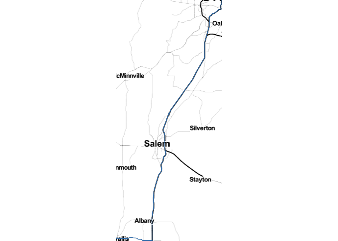

Get coordinates of route Corvallis, OR to Portland, OR
================

``` r
library(tidyverse)
```

    ## ── Attaching packages ─────────────────────────────────────── tidyverse 1.2.1 ──

    ## ✔ ggplot2 3.2.0     ✔ purrr   0.3.2
    ## ✔ tibble  2.1.3     ✔ dplyr   0.8.3
    ## ✔ tidyr   0.8.3     ✔ stringr 1.4.0
    ## ✔ readr   1.3.1     ✔ forcats 0.4.0

    ## ── Conflicts ────────────────────────────────────────── tidyverse_conflicts() ──
    ## ✖ dplyr::filter() masks stats::filter()
    ## ✖ dplyr::lag()    masks stats::lag()

``` r
library(routes)
library(here)
```

    ## here() starts at /Users/wickhamc/Documents/Projects/routes/routes

``` r
start <- "Corvallis, OR"
end <- "Portland, OR"
```

## Get coordinates

``` r
route_lat_lon <- get_route(start, end)
```

## Checks

Interactive with leaflet:

``` r
library(leaflet)
leaflet() %>% 
  addTiles() %>% 
  addPolylines(~ lon, ~ lat, data = route_lat_lon)
```

Static with
    ggmap:

``` r
library(ggmap)
```

    ## Google's Terms of Service: https://cloud.google.com/maps-platform/terms/.

    ## Please cite ggmap if you use it! See citation("ggmap") for details.

    ## 
    ## Attaching package: 'ggmap'

    ## The following object is masked from 'package:routes':
    ## 
    ##     route

``` r
bbox <- with(route_lat_lon, 
  c(left = min(lon), bottom = min(lat), 
    right = max(lon), top = max(lat)))

map <- get_stamenmap(bbox, zoom = 9, 
  maptype = "toner-hybrid", source = "stamen", force = TRUE)
```

    ## Source : http://tile.stamen.com/toner-hybrid/9/80/183.png

    ## Source : http://tile.stamen.com/toner-hybrid/9/81/183.png

    ## Source : http://tile.stamen.com/toner-hybrid/9/80/184.png

    ## Source : http://tile.stamen.com/toner-hybrid/9/81/184.png

    ## Source : http://tile.stamen.com/toner-hybrid/9/80/185.png

    ## Source : http://tile.stamen.com/toner-hybrid/9/81/185.png

``` r
ggmap(map) +
  geom_path(data = route_lat_lon, color = "#377EB8") +
  theme_void()
```

<!-- -->

Save for later:

``` r
route_lat_lon %>% 
  write_rds(here("oregon", "route_coords.rds")) %>% 
  write_csv(here("oregon", "route_coords.csv"))
```
