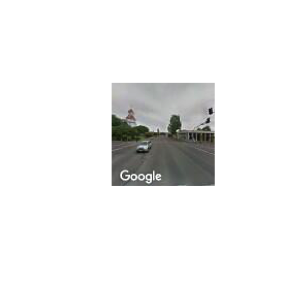
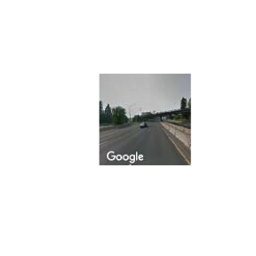

Get Street View images Corvallis, OR to Portland, OR
================

``` r
library(tidyverse)
```

    ## ── Attaching packages ────────────────────────────── tidyverse 1.2.1 ──

    ## ✔ ggplot2 3.2.0     ✔ purrr   0.3.2
    ## ✔ tibble  2.1.3     ✔ dplyr   0.8.3
    ## ✔ tidyr   0.8.3     ✔ stringr 1.4.0
    ## ✔ readr   1.3.1     ✔ forcats 0.4.0

    ## ── Conflicts ───────────────────────────────── tidyverse_conflicts() ──
    ## ✖ dplyr::filter() masks stats::filter()
    ## ✖ dplyr::lag()    masks stats::lag()

``` r
library(routes)
```

    ## Attaching routes version 0.0.2

``` r
library(here)
```

    ## here() starts at /Users/wickhamc/Documents/Projects/routes/routes

``` r
max_images <- 50 # download at most this many images
```

``` r
route_lat_lon <- read_rds(here("oregon", "data", "route_coords.rds"))
```

Only get images for at most 50 points on route:

``` r
every_nth <- ceiling(nrow(route_lat_lon)/max_images)

route_lat_lon_sub <- route_lat_lon %>% 
  slice(seq(1, nrow(route_lat_lon), by = every_nth))
```

Get all Street View images:

``` r
route_images <- route_lat_lon_sub %>% 
  mutate(
    image = pmap_chr(list(lat = lat, lon = lon), 
      possibly(get_img, NA_character_), 
      dir = here("oregon", "images"))  
  )
```

Write out image manifest:

``` r
route_images %>% 
  write_rds(here("oregon", "images", "manifest.rds")) %>% 
  write_csv(here("oregon", "images", "manifest.csv"))
```

## Checks

Look at first and last images:

``` r
route_images %>% 
  slice(1, n()) %>% 
  pull(image) %>% 
  walk(display_jpeg)
```

<!-- --><!-- -->
