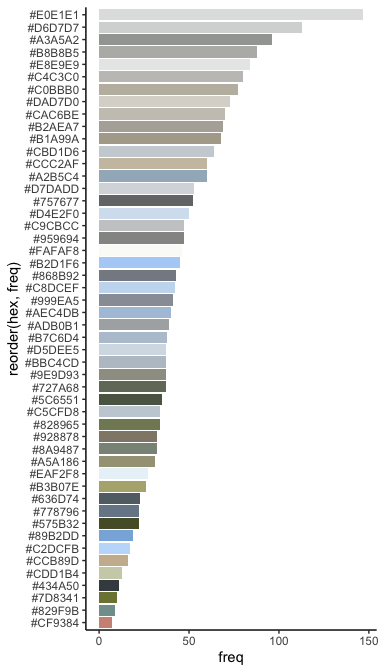
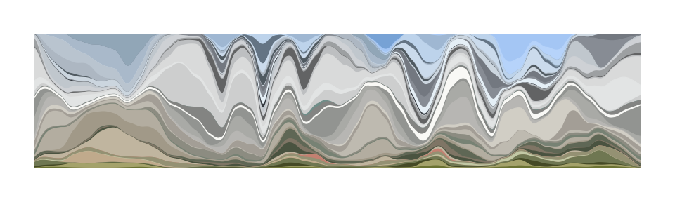

Count and cluster colors for route Corvallis, OR to Portland, OR
================

``` r
library(tidyverse)
library(colorspace)
library(routes)
library(here)
set.seed(21978) # both subsampling and clustering are random, 
                # set a seed to get reproducible image
```

## Read in Streetview image manfest

``` r
route_images <- read_rds(here("oregon", "images", "manifest.rds"))
```

## Get sample of pixels from images

Sample 50 pixels from each image:

``` r
pixel_sample_rgb <- route_images %>% 
  pull(image) %>% 
  map_dfr(sample_pixels, sample_size = 50) %>% 
  with(RGB(R, G, B)) 
```

## Create cluster centers

``` r
cluster_space <- "LUV"
n_clusters <- 50
```

Clustering done in LUV color space, with 50 clusters:

``` r
pixel_sample_space <- pixel_sample_rgb %>% 
  as(cluster_space)

clusters <- kmeans(pixel_sample_space@coords, centers = n_clusters)
centers <- match.fun(cluster_space)(clusters$center)

centers %>% hex() %>% pal()
```

<!-- -->

## Count pixels in each cluster

``` r
color_freq_sample <- count_colours(pixel_sample_rgb, centers,
  colorspace = cluster_space)
```

Histogram of counts based on sample:

``` r
color_freq_sample %>% 
  ggplot(aes(hex, freq, fill = hex)) +
    geom_col() +
  scale_fill_identity() +
  coord_flip()
```

<!-- -->

## Count pixels in each image

``` r
route_images <- route_images %>% 
  mutate(
    pixels = map(image, read_pixels) %>% map(RGB),
    color_count = map(pixels, count_colours, 
      centers = centers, colorspace = "LUV")) %>% 
  unnest(color_count) %>% 
  mutate(H = as(LUV(L, U, V), "polarLUV")@coords[, "H"])
```

## Initial Plot

``` r
route_images %>% 
  ggplot(aes(order, freq)) +
    geom_area(aes(fill = hex)) +
  scale_fill_identity() +
  scale_color_identity() +
  equal_margins()
```

<!-- -->

``` r
orderby <- quo(V)
```

You might try re-ordering the colors by one of the color dimensions,
e.g. V, other options are `H`, `U` or `L`:

``` r
route_images %>% 
  ggplot(aes(order, freq)) +
    geom_area(aes(fill = reorder(hex, !!orderby))) +
  scale_fill_identity() +
  scale_color_identity() +
  equal_margins()
```

<!-- -->

## (Optional) Smoothing

The landscape is too complex and you want to smooth out the wiggles.
This approach uses a loess smoother to average frequencies for each
color. Adjust the span closer to 1 for more smoothing, closer to zero
for less:

``` r
span <- 0.9
```

``` r
route_smooth <- 
  route_images %>% 
  group_by(hex, L, U, V, H) %>% 
  nest() %>% 
  mutate(
    loess = map(data, ~ loess(sqrt(freq) ~ order, data = ., span = span)),
    smooth = map(loess, ~ broom::augment(.) %>% select(order, freq = .fitted))) %>% 
  unnest(smooth)  %>% 
  mutate(freq = freq^2) 
```

There is no guarantee the areas add to a constant, so this often gives a
wavy top and bottom:

``` r
route_smooth  %>% 
  ggplot(aes(order, freq)) +
    geom_area(aes(fill = reorder(hex, !!orderby), color = hex)) +
  scale_fill_identity() +
  scale_color_identity() +
  equal_margins()
```

<!-- -->

Scaling to have frequencies add to 1 restores the rectangular
boundaries:

``` r
route_smooth  %>% 
  group_by(order) %>% 
  mutate(freq = freq/(sum(freq))) %>% 
  ggplot(aes(order, freq)) +
    geom_area(aes(fill = reorder(hex, !!orderby), color = hex)) +
  scale_fill_identity() +
  scale_color_identity() +
  equal_margins() 
```

<!-- -->

## (Optional) Interpolate

You like the complexity of the plot, but you want the transitions to be
smoother. This approach adds intermediate points on the x-axis, allowing
a smoother transition.

``` r
# set up a grid along x-axis
order_grid <- seq(1, max(route_images$order), length.out = 1000)
```

``` r
route_interpolate <- 
  route_images %>% 
  group_by(hex, L, U, V, H) %>% 
  nest() %>% 
  mutate(
    smooth_fun = map(data, ~ 
      with(., splinefun(order, sqrt(freq), method = "natural"))),
    smooth = map(smooth_fun, ~ tibble(order = order_grid, freq = invoke(., x = order_grid)^2))
  ) %>% 
  unnest(smooth) %>%  
  group_by(order) %>% 
  mutate(freq = freq/sum(freq)) 
```

``` r
route_interpolate %>% 
  ggplot(aes(order, freq)) +
    geom_area(aes(fill = reorder(hex, !!orderby), color = hex)) +
  scale_fill_identity() +
  scale_color_identity() +
  equal_margins()
```

<!-- -->

## Save image

`height` and `width` are in inches, `dpi = 300` is good for professional
printing:

``` r
ggsave(here("oregon", "oregon_route.jpeg"), 
  height = 6, width = 20, dpi = 300)
```
